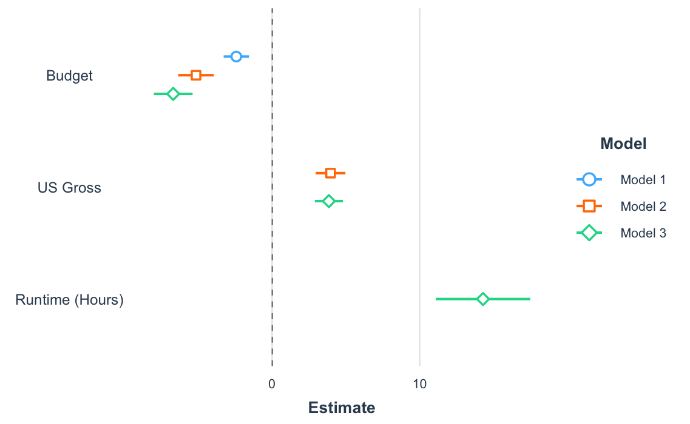
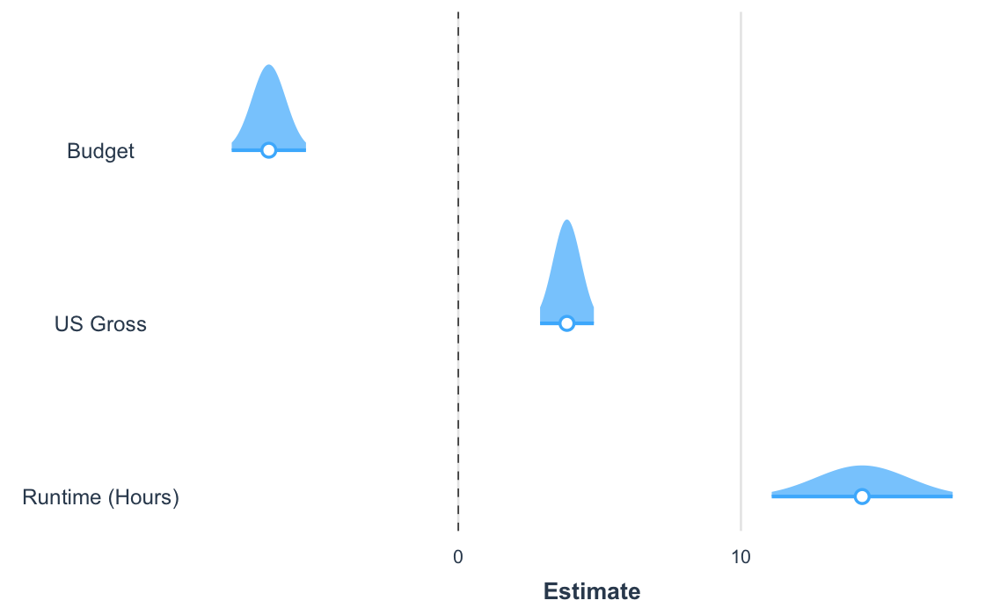
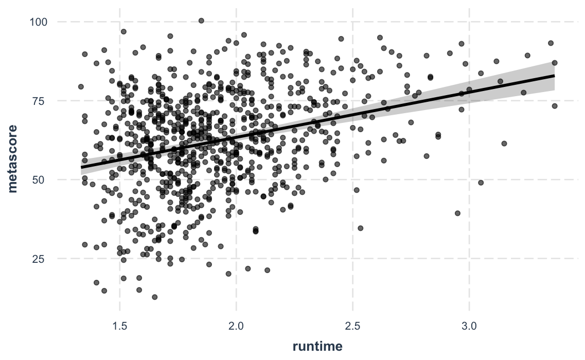

<!-- README.md is generated from README.Rmd. Please edit that file -->

# jtools

[](https://cran.r-project.org/package=jtools)
[](https://cran.r-project.org/package=jtools)
[](https://bestpractices.coreinfrastructure.org/projects/2527)
[](https://travis-ci.org/jacob-long/jtools)
[](https://ci.appveyor.com/project/jacob-long/JTools)
[](https://codecov.io/gh/jacob-long/jtools)
<!-- [](https://github.com/jacob-long/jtools) -->
<!-- [](https://www.repostatus.org/#active) [](https://opensource.org/licenses/MIT) -->

This package consists of a series of functions created by the author
(Jacob) to automate otherwise tedious research tasks. At this juncture,
the unifying theme is the more efficient presentation of regression
analyses. There are a number of functions for other programming and
statistical purposes as well. Support for the `survey` package’s
`svyglm` objects as well as weighted regressions is a common theme
throughout.

**Notice:** As of `jtools` version 2.0.0, all functions dealing with
interactions (e.g., `interact_plot()`, `sim_slopes()`,
`johnson_neyman()`) have been moved to a new package, aptly named
[`interactions`](https://interactions.jacob-long.com).

## Installation

For the most stable version, simply install from CRAN.

``` r
install.packages("jtools")
```

If you want the latest features and bug fixes then you can download from
Github. To do that you will need to have `devtools` installed if you
don’t already:

``` r
install.packages("devtools")
```

Then install the package from Github.

``` r
devtools::install_github("jacob-long/jtools")
```

You should also check out the
[`dev`](https://github.com/jacob-long/jtools/tree/dev) branch of this
repository for the latest and greatest changes, but also the latest and
greatest bugs. To see what features are on the roadmap, check the issues
section of the repository, especially the “enhancement” tag.

## Usage

Here’s a synopsis of the current functions in the package:

### Console regression summaries (`summ()`)

`summ()` is a replacement for `summary()` that provides the user several
options for formatting regression summaries. It supports `glm`,
`svyglm`, and `merMod` objects as input as well. It supports calculation
and reporting of robust standard errors via the `sandwich` package.

Basic use:

``` r
data(movies)
fit <- lm(metascore ~ budget + us_gross + year, data = movies)
summ(fit)
```

    #> MODEL INFO:
    #> Observations: 831 (10 missing obs. deleted)
    #> Dependent Variable: metascore
    #> Type: OLS linear regression 
    #> 
    #> MODEL FIT:
    #> F(3,827) = 26.23, p = 0.00
    #> R² = 0.09
    #> Adj. R² = 0.08 
    #> 
    #> Standard errors: OLS
    #> --------------------------------------------------
    #>                      Est.     S.E.   t val.      p
    #> ----------------- ------- -------- -------- ------
    #> (Intercept)         52.06   139.67     0.37   0.71
    #> budget              -0.00     0.00    -5.89   0.00
    #> us_gross             0.00     0.00     7.61   0.00
    #> year                 0.01     0.07     0.08   0.94
    #> --------------------------------------------------

It has several conveniences, like re-fitting your model with scaled
variables (`scale = TRUE`). You have the option to leave the outcome
variable in its original scale (`transform.response = TRUE`), which is
the default for scaled models. I’m a fan of Andrew Gelman’s 2 SD
standardization method, so you can specify by how many standard
deviations you would like to rescale (`n.sd = 2`).

You can also get variance inflation factors (VIFs) and
partial/semipartial (AKA part) correlations. Partial correlations are
only available for OLS models. You may also substitute confidence
intervals in place of standard errors and you can choose whether to show
p
values.

``` r
summ(fit, scale = TRUE, vifs = TRUE, part.corr = TRUE, confint = TRUE, pvals = FALSE)
```

    #> MODEL INFO:
    #> Observations: 831 (10 missing obs. deleted)
    #> Dependent Variable: metascore
    #> Type: OLS linear regression 
    #> 
    #> MODEL FIT:
    #> F(3,827) = 26.23, p = 0.00
    #> R² = 0.09
    #> Adj. R² = 0.08 
    #> 
    #> Standard errors: OLS
    #> ------------------------------------------------------------------------------
    #>                      Est.    2.5%   97.5%   t val.    VIF   partial.r   part.r
    #> ----------------- ------- ------- ------- -------- ------ ----------- --------
    #> (Intercept)         63.01   61.91   64.11   112.23                            
    #> budget              -3.78   -5.05   -2.52    -5.89   1.31       -0.20    -0.20
    #> us_gross             5.28    3.92    6.64     7.61   1.52        0.26     0.25
    #> year                 0.05   -1.18    1.28     0.08   1.24        0.00     0.00
    #> ------------------------------------------------------------------------------
    #> 
    #> Continuous predictors are mean-centered and scaled by 1 s.d.

Cluster-robust standard errors:

``` r
data("PetersenCL", package = "sandwich")
fit2 <- lm(y ~ x, data = PetersenCL)
summ(fit2, robust = "HC3", cluster = "firm")
```

    #> MODEL INFO:
    #> Observations: 5000
    #> Dependent Variable: y
    #> Type: OLS linear regression 
    #> 
    #> MODEL FIT:
    #> F(1,4998) = 1310.74, p = 0.00
    #> R² = 0.21
    #> Adj. R² = 0.21 
    #> 
    #> Standard errors: Cluster-robust, type = HC3
    #> -----------------------------------------------
    #>                     Est.   S.E.   t val.      p
    #> ----------------- ------ ------ -------- ------
    #> (Intercept)         0.03   0.07     0.44   0.66
    #> x                   1.03   0.05    20.36   0.00
    #> -----------------------------------------------

Of course, `summ()` like `summary()` is best-suited for interactive use.
When it comes to sharing results with others, you want sharper output
and probably graphics. `jtools` has some options for that,
too.

### LaTeX-, Word-, and RMarkdown-friendly regression summary tables (`export_summs()`)

For tabular output, `export_summs()` is an interface to the `huxtable`
package’s `huxreg()` function that preserves the niceties of `summ()`,
particularly its facilities for robust standard errors and
standardization. It also concatenates multiple models into a single
table.

``` r
fit <- lm(metascore ~ log(budget), data = movies)
fit_b <- lm(metascore ~ log(budget) + log(us_gross), data = movies)
fit_c <- lm(metascore ~ log(budget) + log(us_gross) + runtime, data = movies)
coef_names <- c("Budget" = "log(budget)", "US Gross" = "log(us_gross)",
                "Runtime (Hours)" = "runtime", "Constant" = "(Intercept)")
export_summs(fit, fit_b, fit_c, robust = "HC3", coefs = coef_names)
```

    #> Registered S3 methods overwritten by 'broom':
    #>   method            from  
    #>   tidy.glht         jtools
    #>   tidy.summary.glht jtools

<table class="huxtable" style="border-collapse: collapse; border: 0px; margin-bottom: 2em; margin-top: 2em; ; margin-left: auto; margin-right: auto;  " id="tab:unnamed-chunk-6">

<col>

<col>

<col>

<col>

<tr>

<th style="vertical-align: top; text-align: center; white-space: normal; border-style: solid solid solid solid; border-width: 0.8pt 0pt 0pt 0pt;    padding: 6pt 6pt 6pt 6pt; font-weight: normal;">

</th>

<th style="vertical-align: top; text-align: center; white-space: normal; border-style: solid solid solid solid; border-width: 0.8pt 0pt 0.4pt 0pt;    padding: 6pt 6pt 6pt 6pt; font-weight: normal;">

Model
1

</th>

<th style="vertical-align: top; text-align: center; white-space: normal; border-style: solid solid solid solid; border-width: 0.8pt 0pt 0.4pt 0pt;    padding: 6pt 6pt 6pt 6pt; font-weight: normal;">

Model
2

</th>

<th style="vertical-align: top; text-align: center; white-space: normal; border-style: solid solid solid solid; border-width: 0.8pt 0pt 0.4pt 0pt;    padding: 6pt 6pt 6pt 6pt; font-weight: normal;">

Model
3

</th>

</tr>

<tr>

<th style="vertical-align: top; text-align: left; white-space: normal; padding: 6pt 6pt 6pt 6pt; font-weight: normal;">

Budget

</th>

<td style="vertical-align: top; text-align: right; white-space: normal; border-style: solid solid solid solid; border-width: 0.4pt 0pt 0pt 0pt;    padding: 6pt 6pt 6pt 6pt; font-weight: normal;">

\-2.43
\*\*\*

</td>

<td style="vertical-align: top; text-align: right; white-space: normal; border-style: solid solid solid solid; border-width: 0.4pt 0pt 0pt 0pt;    padding: 6pt 6pt 6pt 6pt; font-weight: normal;">

\-5.16
\*\*\*

</td>

<td style="vertical-align: top; text-align: right; white-space: normal; border-style: solid solid solid solid; border-width: 0.4pt 0pt 0pt 0pt;    padding: 6pt 6pt 6pt 6pt; font-weight: normal;">

\-6.70
\*\*\*

</td>

</tr>

<tr>

<th style="vertical-align: top; text-align: left; white-space: normal; padding: 6pt 6pt 6pt 6pt; font-weight: normal;">

</th>

<td style="vertical-align: top; text-align: right; white-space: normal; padding: 6pt 6pt 6pt 6pt; font-weight: normal;">

(0.44)   

</td>

<td style="vertical-align: top; text-align: right; white-space: normal; padding: 6pt 6pt 6pt 6pt; font-weight: normal;">

(0.62)   

</td>

<td style="vertical-align: top; text-align: right; white-space: normal; padding: 6pt 6pt 6pt 6pt; font-weight: normal;">

(0.67)   

</td>

</tr>

<tr>

<th style="vertical-align: top; text-align: left; white-space: normal; padding: 6pt 6pt 6pt 6pt; font-weight: normal;">

US
Gross

</th>

<td style="vertical-align: top; text-align: right; white-space: normal; padding: 6pt 6pt 6pt 6pt; font-weight: normal;">

       

</td>

<td style="vertical-align: top; text-align: right; white-space: normal; padding: 6pt 6pt 6pt 6pt; font-weight: normal;">

3.96
\*\*\*

</td>

<td style="vertical-align: top; text-align: right; white-space: normal; padding: 6pt 6pt 6pt 6pt; font-weight: normal;">

3.85
\*\*\*

</td>

</tr>

<tr>

<th style="vertical-align: top; text-align: left; white-space: normal; padding: 6pt 6pt 6pt 6pt; font-weight: normal;">

</th>

<td style="vertical-align: top; text-align: right; white-space: normal; padding: 6pt 6pt 6pt 6pt; font-weight: normal;">

       

</td>

<td style="vertical-align: top; text-align: right; white-space: normal; padding: 6pt 6pt 6pt 6pt; font-weight: normal;">

(0.51)   

</td>

<td style="vertical-align: top; text-align: right; white-space: normal; padding: 6pt 6pt 6pt 6pt; font-weight: normal;">

(0.48)   

</td>

</tr>

<tr>

<th style="vertical-align: top; text-align: left; white-space: normal; padding: 6pt 6pt 6pt 6pt; font-weight: normal;">

Runtime
(Hours)

</th>

<td style="vertical-align: top; text-align: right; white-space: normal; padding: 6pt 6pt 6pt 6pt; font-weight: normal;">

       

</td>

<td style="vertical-align: top; text-align: right; white-space: normal; padding: 6pt 6pt 6pt 6pt; font-weight: normal;">

       

</td>

<td style="vertical-align: top; text-align: right; white-space: normal; padding: 6pt 6pt 6pt 6pt; font-weight: normal;">

14.29
\*\*\*

</td>

</tr>

<tr>

<th style="vertical-align: top; text-align: left; white-space: normal; padding: 6pt 6pt 6pt 6pt; font-weight: normal;">

</th>

<td style="vertical-align: top; text-align: right; white-space: normal; padding: 6pt 6pt 6pt 6pt; font-weight: normal;">

       

</td>

<td style="vertical-align: top; text-align: right; white-space: normal; padding: 6pt 6pt 6pt 6pt; font-weight: normal;">

       

</td>

<td style="vertical-align: top; text-align: right; white-space: normal; padding: 6pt 6pt 6pt 6pt; font-weight: normal;">

(1.63)   

</td>

</tr>

<tr>

<th style="vertical-align: top; text-align: left; white-space: normal; padding: 6pt 6pt 6pt 6pt; font-weight: normal;">

Constant

</th>

<td style="vertical-align: top; text-align: right; white-space: normal; padding: 6pt 6pt 6pt 6pt; font-weight: normal;">

105.29
\*\*\*

</td>

<td style="vertical-align: top; text-align: right; white-space: normal; padding: 6pt 6pt 6pt 6pt; font-weight: normal;">

81.84
\*\*\*

</td>

<td style="vertical-align: top; text-align: right; white-space: normal; padding: 6pt 6pt 6pt 6pt; font-weight: normal;">

83.35
\*\*\*

</td>

</tr>

<tr>

<th style="vertical-align: top; text-align: left; white-space: normal; padding: 6pt 6pt 6pt 6pt; font-weight: normal;">

</th>

<td style="vertical-align: top; text-align: right; white-space: normal; border-style: solid solid solid solid; border-width: 0pt 0pt 0.4pt 0pt;    padding: 6pt 6pt 6pt 6pt; font-weight: normal;">

(7.65)   

</td>

<td style="vertical-align: top; text-align: right; white-space: normal; border-style: solid solid solid solid; border-width: 0pt 0pt 0.4pt 0pt;    padding: 6pt 6pt 6pt 6pt; font-weight: normal;">

(8.66)   

</td>

<td style="vertical-align: top; text-align: right; white-space: normal; border-style: solid solid solid solid; border-width: 0pt 0pt 0.4pt 0pt;    padding: 6pt 6pt 6pt 6pt; font-weight: normal;">

(8.82)   

</td>

</tr>

<tr>

<th style="vertical-align: top; text-align: left; white-space: normal; padding: 6pt 6pt 6pt 6pt; font-weight: normal;">

N

</th>

<td style="vertical-align: top; text-align: right; white-space: normal; border-style: solid solid solid solid; border-width: 0.4pt 0pt 0pt 0pt;    padding: 6pt 6pt 6pt 6pt; font-weight: normal;">

831       

</td>

<td style="vertical-align: top; text-align: right; white-space: normal; border-style: solid solid solid solid; border-width: 0.4pt 0pt 0pt 0pt;    padding: 6pt 6pt 6pt 6pt; font-weight: normal;">

831       

</td>

<td style="vertical-align: top; text-align: right; white-space: normal; border-style: solid solid solid solid; border-width: 0.4pt 0pt 0pt 0pt;    padding: 6pt 6pt 6pt 6pt; font-weight: normal;">

831       

</td>

</tr>

<tr>

<th style="vertical-align: top; text-align: left; white-space: normal; border-style: solid solid solid solid; border-width: 0pt 0pt 0.8pt 0pt;    padding: 6pt 6pt 6pt 6pt; font-weight: normal;">

R2

</th>

<td style="vertical-align: top; text-align: right; white-space: normal; border-style: solid solid solid solid; border-width: 0pt 0pt 0.8pt 0pt;    padding: 6pt 6pt 6pt 6pt; font-weight: normal;">

0.03    

</td>

<td style="vertical-align: top; text-align: right; white-space: normal; border-style: solid solid solid solid; border-width: 0pt 0pt 0.8pt 0pt;    padding: 6pt 6pt 6pt 6pt; font-weight: normal;">

0.09    

</td>

<td style="vertical-align: top; text-align: right; white-space: normal; border-style: solid solid solid solid; border-width: 0pt 0pt 0.8pt 0pt;    padding: 6pt 6pt 6pt 6pt; font-weight: normal;">

0.17    

</td>

</tr>

<tr>

<th colspan="4" style="vertical-align: top; text-align: left; white-space: normal; border-style: solid solid solid solid; border-width: 0.8pt 0pt 0pt 0pt;    padding: 6pt 6pt 6pt 6pt; font-weight: normal;">

Standard errors are heteroskedasticity robust. \*\*\* p \< 0.001; \*\* p
\< 0.01; \* p \< 0.05.

</th>

</tr>

</table>

In RMarkdown documents, using `export_summs()` and the chunk option
`results = 'asis'` will give you nice-looking tables in HTML and PDF
output. Using the `to.word = TRUE` argument will create a Microsoft Word
document with the table in it.

### Plotting regression summaries (`plot_coefs()` and `plot_summs()`)

Another way to get a quick gist of your regression analysis is to plot
the values of the coefficients and their corresponding uncertainties
with `plot_summs()` (or the closely related `plot_coefs()`). Like with
`export_summs()`, you can still get your scaled models and robust
standard errors.

``` r
coef_names <- coef_names[1:3] # Dropping intercept for plots
plot_summs(fit, fit_b, fit_c, robust = "HC3", coefs = coef_names)
```

<!-- -->

And since you get a `ggplot` object in return, you can tweak and theme
as you wish.

Another way to visualize the uncertainty of your coefficients is via the
`plot.distributions`
argument.

``` r
plot_summs(fit_c, robust = "HC3", coefs = coef_names, plot.distributions = TRUE)
```

<!-- -->

These show the 95% interval width of a normal distribution for each
estimate.

`plot_coefs()` works much the same way, but without support for `summ()`
arguments like `robust` and `scale`. This enables a wider range of
models that have support from the `broom` package but not for `summ()`.

### Plotting model predictions (`effect_plot()`)

Sometimes the best way to understand your model is to look at the
predictions it generates. Rather than look at coefficients,
`effect_plot()` lets you plot predictions across values of a predictor
variable alongside the observed
    data.

``` r
effect_plot(fit_c, pred = runtime, interval = TRUE, plot.points = TRUE)
```

    #> Using data movies from global environment. This could cause incorrect
    #> results if movies has been altered since the model was fit. You can
    #> manually provide the data to the "data =" argument.

    #> Warning: Removed 10 rows containing missing values (geom_point).

<!-- -->

And a new feature in version `2.0.0` lets you plot *partial residuals*
instead of the raw observed data, allowing you to assess model quality
after accounting for effects of control
variables.

``` r
effect_plot(fit_c, pred = runtime, interval = TRUE, partial.residuals = TRUE)
```

    #> Using data movies from global environment. This could cause incorrect
    #> results if movies has been altered since the model was fit. You can
    #> manually provide the data to the "data =" argument.

<!-- -->

Categorical predictors, polynomial terms, (G)LM(M)s, weighted data, and
much more are supported.

### Other stuff

There are several other things that might interest you.

  - `gscale()`: Scale and/or mean-center data, including `svydesign`
    objects
  - `scale_mod()` and `center_mod()`: Re-fit models with scaled and/or
    mean-centered data
  - `wgttest()` and `pf_sv_test()`, which are combined in
    `weights_tests()`: Test the ignorability of sample weights in
    regression models
  - `svycor()`: Generate correlation matrices from `svydesign` objects
  - `theme_apa()`: A mostly APA-compliant `ggplot2` theme
  - `theme_nice()`: A nice `ggplot2` theme
  - `add_gridlines()` and `drop_gridlines()`: `ggplot2` theme-changing
    convenience functions
  - `make_predictions()`: an easy way to generate hypothetical predicted
    data from your regression model for plotting or other purposes.

Details on the arguments can be accessed via the R documentation
(`?functionname`). There are now vignettes documenting just about
everything you can do as well.

## Contributing

I’m happy to receive bug reports, suggestions, questions, and (most of
all) contributions to fix problems and add features. I prefer you use
the Github issues system over trying to reach out to me in other ways.
Pull requests for contributions are encouraged. If you are considering
writing up a bug fix or new feature, please check out the [contributing
guidelines](https://github.com/jacob-long/jtools/blob/master/CONTRIBUTING.md).

Please note that this project is released with a [Contributor Code of
Conduct](https://github.com/jacob-long/jtools/blob/master/CONDUCT.md).
By participating in this project you agree to abide by its terms.

## License

The source code of this package is licensed under the [MIT
License](https://opensource.org/licenses/mit-license.php).
